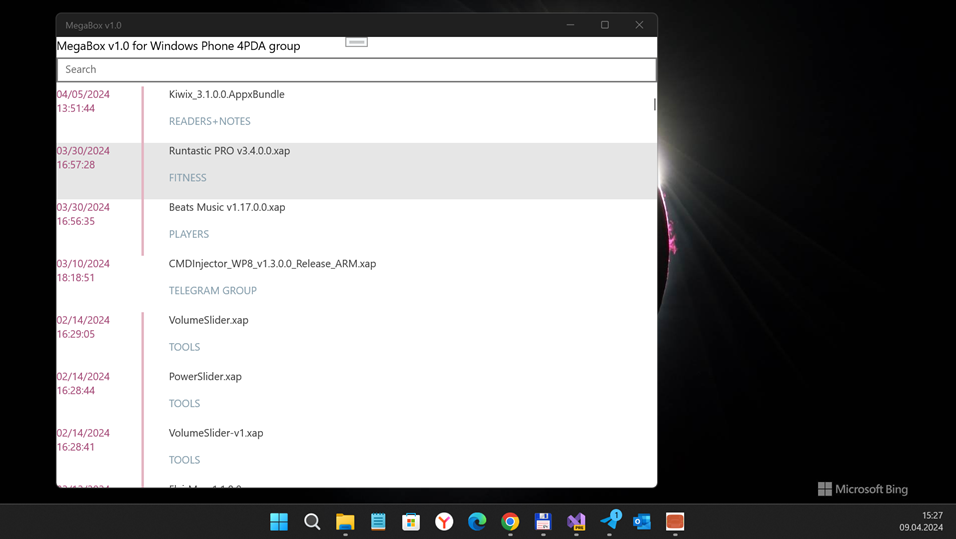

# MegaBox v2 (AstoriaStore codename) - ProjectA branch

## About
Simplest multi-platform 4PDA Project Astoria Mega's appx file downloader & launcher (special for Windows Phone fans).

## Screenshots

## Features
- Easy *dark mode* (no settings, etc.)) 
- No folders - "flat size" ;)
- Autolaunch downloaded file (RnD, "As-Is")
- App Search (sloooowest, but works)))
- *List sorting* (Date modification used)

Used Mega Storage (URL): https://mega.nz/folder/yx4EhSZJ#KENf3nCTSTRY-auFQC18Pw

## Tech details
- *Xamarin Forms multi-platform app* that have targets: UWP; Android; iOS (template only, not used))
- Min. W10M os build: 10240 (so, Project Astoria acceptable)

## Status
- Draft. Work in sloooow progress ;)
- Appx launches not ready... (?)

## System requirements
- Visual Studio 2017 or 2022 (Preview)
- Minimal Windows 10 Mobile os's build: 10270 (Astoria)

## Quick Start for your own experiments and my code modifications
- Clone the repo from GitHub
- Open in Visual Studio
- to start this Xamarin app at Windows 10 Mobile (Phone), choose target "ARM";  
  to run this Xamarin app at Windows 10 (Desktop), use target "x86" or "x64" 

## .
AS IS. No support. RnD only. DIY!

## ..
-- [m][e] 2024
