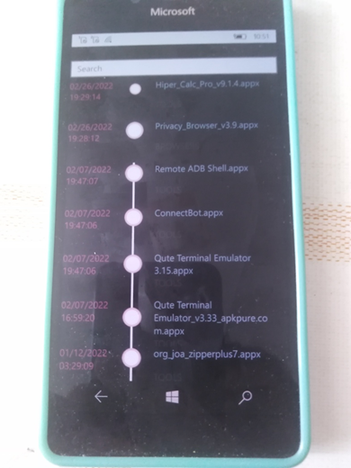

# MegaBox v1 - master branch

## About
Simple multi-platform 4PDA Project Astoria Mega's appx file downloader & launcher (special Windows Phone 4PDA fans)

## Screenshots

## Features
- Easy mode (no settings, etc.) 
- No folders
- Autolaunch downloaded file (RnD, "As-Is")
- App Search (sloooowest, but works)))
- *List sorting* (Date modification used)

Used Mega Storage URL : https://mega.nz/folder/SKZxnQAR#EvlQqjMIVQwoxcje9r-jAw

## Tech details
- *Xamarin Forms multi-platform app*
- Min. W10M os build: 10240 (so, Project Astoria acceptable)
- Targets: UWP; Android; iOS (experimental))

## Status
- Appx launches not ready... (?)

## System requirements
- Minimal Windows 10 Mobile os's build: 10570 (Astoria)

## Quick Start for your own experiments and my code modifications
- Clone the repo from GitHub
- Open in Visual Studio 022 Preview
- for start this Xamarin app at Windows 10 Mobile (Phone), choose target "ARM";  
to run this Xamarin app at Windows 10 (Desktop), choose target "x86". 

## .
AS IS. No support. RnD only. DIY!

## ..
-- [m][e] 2024
